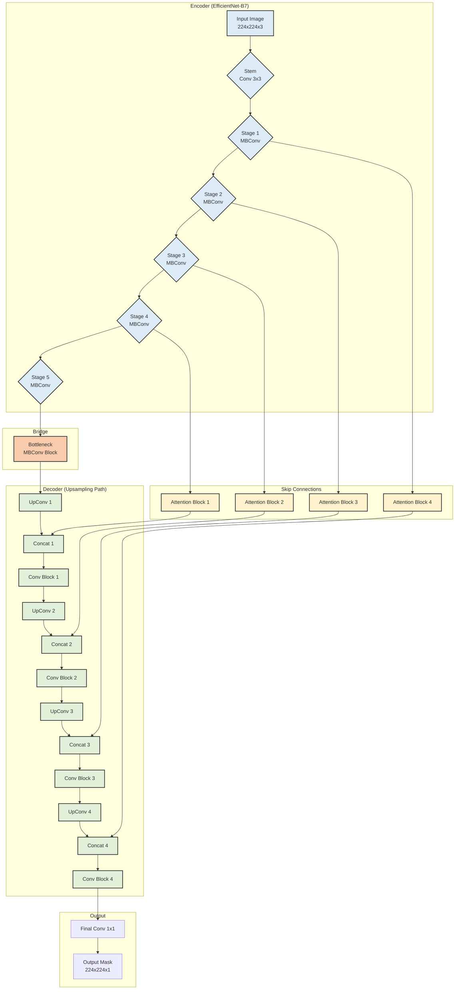

# Custom U-Net Architecture with EfficientNet-B7 Backbone and Attention

This document outlines the architecture of a custom U-Net model that leverages EfficientNet-B7 as its encoder backbone and includes attention mechanisms in the skip connections.

### Architecture Details:

1.  **Encoder**: The encoder is a pre-trained EfficientNet-B7 network. It processes the input image through its successive stages, downsampling the spatial dimensions and increasing the feature depth. Each stage shown in the diagram corresponds to a set of MBConv blocks from the original EfficientNet architecture.

2.  **Bridge/Bottleneck**: This is the deepest part of the network, connecting the encoder and the decoder. It consists of the final block of the EfficientNet encoder.

3.  **Decoder**: The decoder is the upsampling path. It takes the feature map from the bottleneck and progressively upsamples it. At each upsampling step, the feature map is concatenated with features from the corresponding level of the encoder via a skip connection.

4.  **Skip Connections & Attention Blocks**: Before the features from the encoder are concatenated with the decoder's feature maps, they are passed through an **Attention Block**. This block helps the model to focus on the most relevant features from the encoder path, improving the segmentation accuracy.

5.  **Output**: The final decoder block's output is passed through a 1x1 convolution to produce the final segmentation mask with the desired number of classes.
