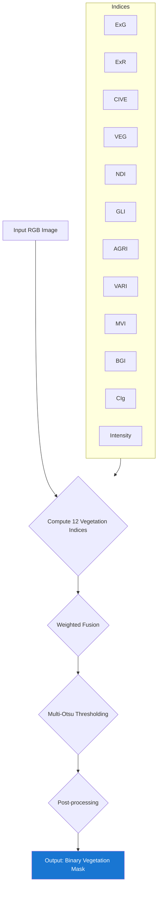

# Module 1: Vegetation Segmentation Architecture

This diagram details the unsupervised process for extracting vegetation areas from field images by computing and fusing multiple vegetation indices.

