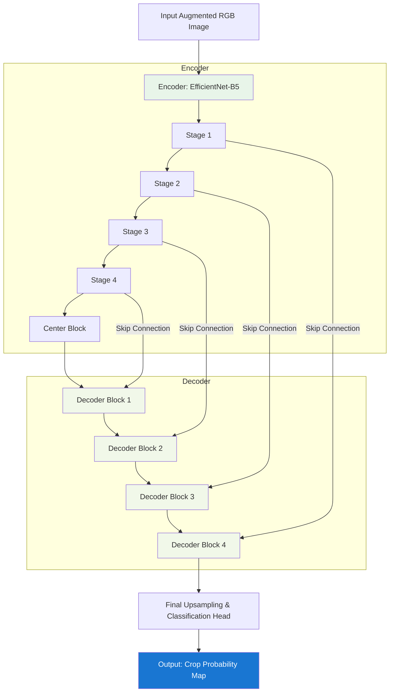

# Module 3: Crop Masking Architecture (U-Net + EfficientNet)

This diagram shows the architecture of the crop segmentation model, featuring an EfficientNet-B5 encoder and a U-Net decoder with SCSE attention.

