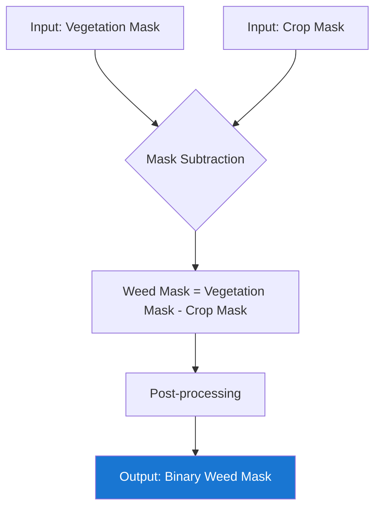

# Module 4: Weed Mask Generation Architecture

This diagram illustrates the logic-based process for generating weed masks by subtracting crop areas from the overall vegetation areas.

```mermaid
graph TD
    A[Input: Vegetation Mask] --> C{Mask Subtraction};
    B[Input: Crop Mask] --> C;
    C --> D[Weed Mask = Vegetation Mask - Crop Mask];
    D --> E[Post-processing];
    E --> F[Output: Binary Weed Mask];

    style F fill:#1976d2,color:#fff
```
