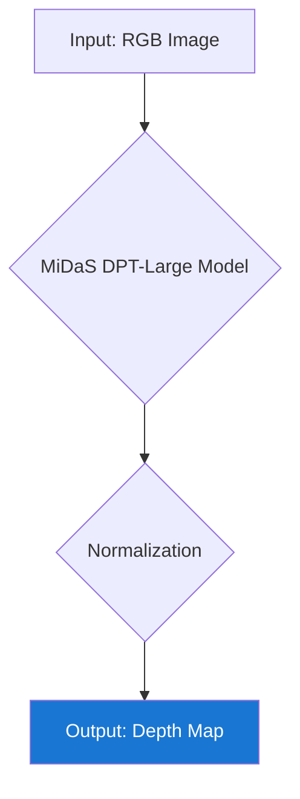

# Module 5: Depth Feature Generation Architecture

This diagram shows the process of generating depth maps from RGB images using the pre-trained MiDaS DPT-Large model.

```mermaid
graph TD
    A[Input: RGB Image] --> B{MiDaS DPT-Large Model};
    B --> C{Normalization};
    C --> D[Output: Depth Map];

    style D fill:#1976d2,color:#fff
```
