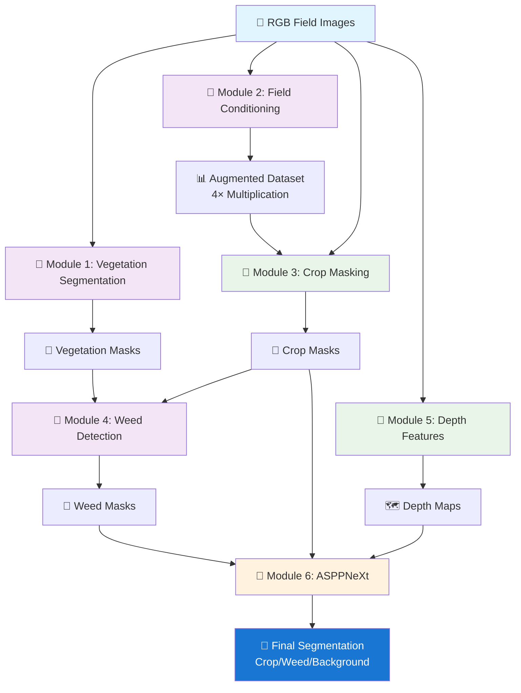

# High-Level System Architecture

This diagram illustrates the complete workflow of the Weed Detection and Density Estimation System, showing the sequence of modules from input to final output.

```mermaid
graph TD
    A[📸 RGB Field Images] --> B[🌱 Module 1: Vegetation Segmentation];
    A --> C[🔄 Module 2: Field Conditioning];
    A --> D[🎯 Module 3: Crop Masking];
    
    B --> E[🌿 Vegetation Masks];
    C --> F[📊 Augmented Dataset<br/>4× Multiplication];
    F --> D;
    D --> G[🌾 Crop Masks];
    
    E --> H[🚫 Module 4: Weed Detection];
    G --> H;
    H --> I[🌿 Weed Masks];
    
    A --> J[📏 Module 5: Depth Features];
    J --> K[🗺️ Depth Maps];
    
    G --> L[🧠 Module 6: ASPPNeXt];
    I --> L;
    K --> L;
    
    L --> M[🎯 Final Segmentation<br/>Crop/Weed/Background];
    
    style A fill:#e1f5fe
    style M fill:#1976d2,color:#fff
    style B fill:#f3e5f5
    style C fill:#f3e5f5
    style D fill:#e8f5e8
    style H fill:#f3e5f5
    style J fill:#e8f5e8
    style L fill:#fff3e0
```
